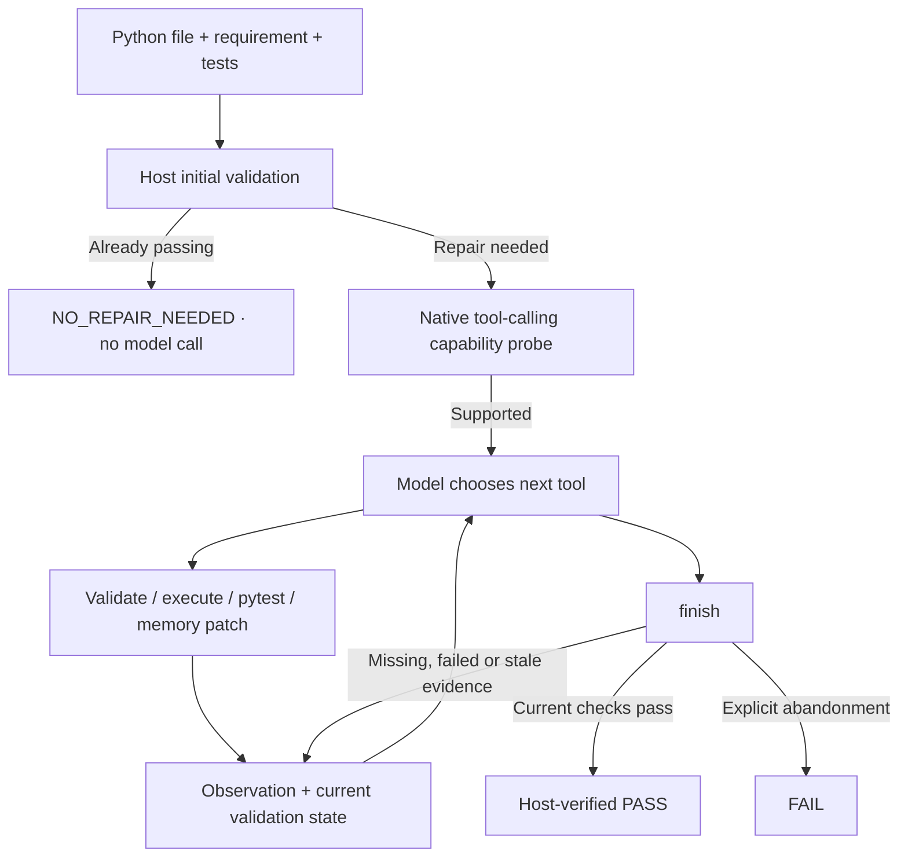

# Dependency-Aware Codegen

[中文](README_CN.md)

A Python repair agent that uses dependency checks, execution and pytest feedback to improve code. The model chooses tools and edits; the host controls permissions, candidate versions and the final verdict.

The main workflow is an **observation-driven Agent loop**, validated locally with Ollama and Qwen3-Coder 30B. The original one-shot repair pipeline remains available as a baseline.

## How the Agent loop works



- **Model-selected actions:** package/API validation, execution, pytest, `apply_patch`, rollback and finish. Repair order is not a fixed script.
- **Evidence-based completion:** a patch invalidates old checks. Premature success returns an observation so the model can continue; a model claim alone cannot establish PASS.
- **Bounded execution:** step, time, protocol-error and repeated-action limits stop stalled runs. Full tool outputs are retained while model context is bounded.
- **Controlled edits:** patches apply atomically to an in-memory candidate. Input hashes, path permissions and AST risk checks protect tool boundaries.

## Quick start

Run from the repository root with Python 3.10+ and Ollama installed:

```powershell
python -m pip install -e ".[dev]"
ollama pull qwen3-coder:30b
```

Save this CLI configuration as `agent.local.json`:

```json
{
  "agent": {
    "provider": "ollama",
    "max_steps": 24,
    "timeout_seconds": 300,
    "ollama": {
      "model_name": "qwen3-coder:30b",
      "base_url": "http://localhost:11434",
      "context_length": 16384,
      "max_new_tokens": 2048,
      "temperature": 0,
      "keep_alive": "10m"
    }
  }
}
```

Run a bundled repair example:

```powershell
python -m depguard.cli agent --config agent.local.json --project-root . --code-file examples/m5/input.py --test-file examples/m5/test_input.py --requirement "Return three as result." --output results/agent_demo.json
```

Replace the file paths and requirement with your own task. Tests are supplied by the user; the repair model does not write the formal tests. `--project-root` defines the allowed project boundary.

**Default: dry-run.** The candidate and trajectory are saved in JSON. Add `--apply` to write the verified candidate back to the source file; persistence uses snapshots, post-write validation and rollback handling. Test files remain read-only.

The output includes `final_status`, `termination_reason`, `agent_invoked`, candidate code/version, validation evidence and a tool trajectory. Correct inputs return `NO_REPAIR_NEEDED`; triggered runs can return `PASS`, `FAIL`, `INCOMPLETE` or `ERROR`. Decision summaries are public action summaries, not hidden reasoning.

For a model-free orchestration demo, use `--config configs/m5_scripted.json` with the same input and tests. This uses scripted decisions and real tools; it is not a model-quality measurement. The legacy `python -m depguard.cli run` command retains one-shot repair; see `run --help` and [its configuration](configs/engineering_7b_ollama.yaml).

## Real local evaluation

A frozen set of 10 repair cases and 5 correct controls, using the same Qwen3-Coder 30B model and formal tests:

| Metric | Result |
| --- | ---: |
| One-shot final pass | 14/15 |
| Agent final pass, including unchanged controls | 15/15 |
| Strict multi-turn rescues | 1/1 |
| Controls preserved without model calls | 5/5 |
| Native protocol success on triggered repairs | 10/10 |
| False success outcomes | 0/15 |

In `weights`, the first patch still failed pytest; the model read that failure, applied another patch and passed. In `runs`, a premature finish was rejected and the model selected the missing checks before finishing successfully.

**The rescue denominator is only one.** These manually prepared, visible-test cases do not establish broad repair superiority. The one-shot baseline was reused unchanged. Compared with the preceding Agent version, average latency increased from 19.392 to 27.119 seconds. Source/test hashes stayed unchanged; scripted tests are excluded from model metrics.

[Full comparison and limitations](results/m72/report.md) · [Machine-readable results](results/m72/summary.json) · [Reproduction](docs/M7_2.md)

## Project foundations and boundaries

The project builds on deterministic AST, package and API analysis, an execution/test harness, and a one-shot repair pipeline. Earlier small-model, LoRA and 7B experiments established these components; their details remain in the [project overview](docs/PROJECT_SUMMARY.md) and historical reports.

- `src/depguard/agent/`: trigger gate, state machine, tools, patching and persistence.
- `src/depguard/models/`: native tool-calling adapters and test providers.
- `src/depguard/analysis/`, `verification/`, `execution/`: host-side validation.
- `evaluation/`, `data/`, `results/`: reproducible cases, evaluators and evidence.

The current scope is **single-file Python repair**, not autonomous repository-wide development. Correctness depends on the supplied tests and validator coverage. AST risk detection and regression checks are conservative heuristics. **Subprocesses, temporary directories and timeouts are not a security sandbox.**

## Tests and documentation

```powershell
python -m pytest
python -m ruff check .
```

Latest verification: **241 passed, 1 skipped** (Windows symlink privilege); ruff passed. Infrastructure checks separately verified 5/5 permission refusals and 1/1 rollback.

[Agent architecture](docs/AGENT_ARCHITECTURE.md) · [Configuration and output contracts](docs/M7_2.md) · [Evaluation artifacts](results/m72/report.md)
