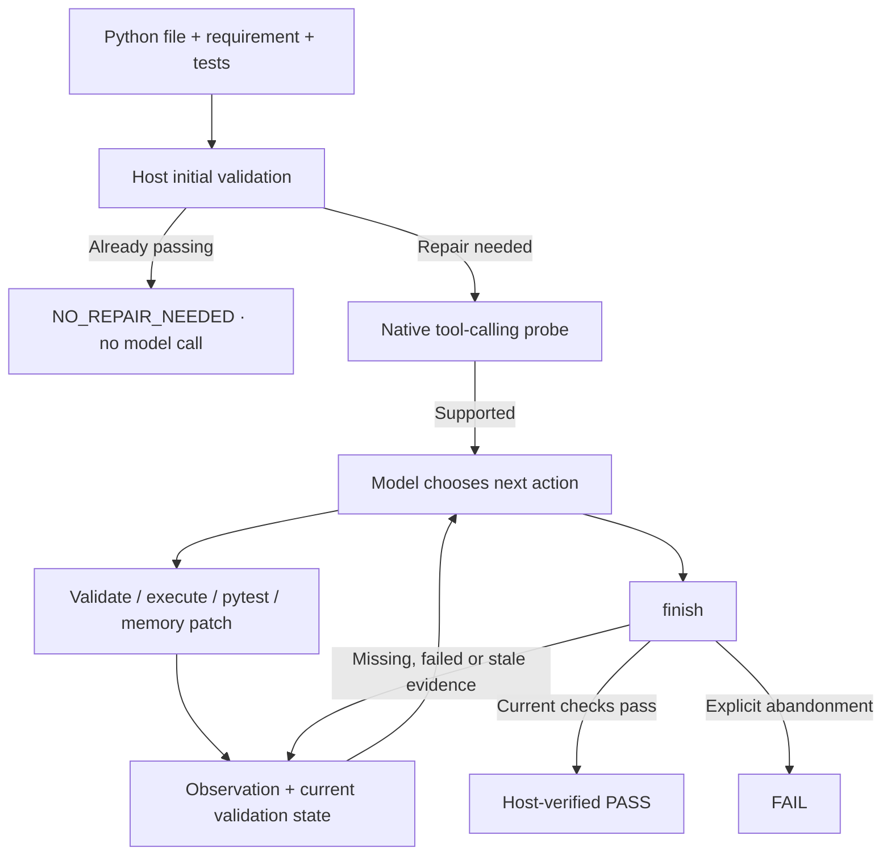

# Dependency-Aware Codegen

[中文说明](README_CN.md)

A Python code-repair project that evolved from dependency-aware validation and small-model experiments into an observation-driven Agent loop. The model chooses tools and edits; the host controls permissions, candidate versions, formal validation and the final verdict.

The current system targets **single-file Python repair** with local Ollama models. The original one-shot workflow remains available as a regression and evaluation baseline.

## Why this project exists

LLM-generated Python may import nonexistent packages, call invalid APIs, use incorrect arguments, fail at runtime, or produce the wrong result despite valid syntax. Asking another model whether the code is correct only moves the uncertainty.

This project combines deterministic AST/package/API checks, execution and pytest evidence with model-based repair. A model proposes actions, but only host-side evidence can establish `PASS`.

## Project evolution

The work followed one continuous engineering path rather than starting directly with a large Agent:

| Stage | Goal and outcome |
| --- | --- |
| **0.5B feasibility baseline** | Built the dataset, deterministic validation pipeline and controlled repair evaluation with a small CPU-friendly code model. This established that structured dependency/API evidence could improve repair prompts, while also exposing the limits of a weak base model. |
| **0.5B LoRA adaptation** | Fine-tuned the small model with PEFT/LoRA using leakage-aware train/validation/test splits. Execution/test passes improved from **77/210** for the generic 0.5B condition to **127/210** for the selected LoRA condition. |
| **7B engineering workflow** | Moved from an experiment-oriented model to local Qwen2.5-Coder 7B through Ollama, then built an external-file CLI with deterministic triggering, structured evidence, one repair attempt and host revalidation. It reached **197/210** on the controlled set and **8/8 repairs + 2/2 controls** on the engineering sanity set. |
| **30B Agent loop** | Upgraded to Qwen3-Coder 30B with native tool calling, memory patches, repeated validation and host-controlled finish. The final frozen evaluation passed **15/15**, including **1/1 strict multi-turn rescue** and **5/5 unchanged controls**. |

The historical experiments show how the project reached its current design; they are not a claim that model size, fine-tuning and Agent architecture were isolated in one controlled ablation. Backends, model sizes and evaluation sets changed across stages.

## Current Agent loop



The loop has several deliberate boundaries:

- **Model-selected strategy:** the model chooses package/API validation, execution, pytest, `apply_patch`, rollback or finish. The host does not impose a fixed repair sequence.
- **Evidence-based completion:** every patch creates a new candidate version and invalidates old checks. A premature success finish becomes `FINISH_PRECONDITION_FAILED`, allowing the model to continue.
- **Safe-by-default edits:** unified diffs apply atomically to an in-memory candidate. Source writes require explicit `--apply`, a verified PASS, snapshots and post-write validation.
- **Bounded context and runtime:** the host limits steps, total time, protocol errors and repeated no-progress actions. Full tool output remains in the artifact while model-visible observations are compacted.
- **Tool-boundary checks:** permissions, path scope, source/test hashes and conservative AST risk analysis are checked before sensitive operations.

## Quick start

Requirements: Python 3.10+, Ollama and a model with native tool calling.

```powershell
python -m pip install -e ".[dev]"
ollama pull qwen3-coder:30b
```

Save the following as `agent.local.json`:

```json
{
  "agent": {
    "provider": "ollama",
    "max_steps": 24,
    "timeout_seconds": 300,
    "ollama": {
      "model_name": "qwen3-coder:30b",
      "base_url": "http://localhost:11434",
      "context_length": 16384,
      "max_new_tokens": 2048,
      "temperature": 0,
      "keep_alive": "10m"
    }
  }
}
```

Run the bundled example:

```powershell
python -m depguard.cli agent --config agent.local.json --project-root . --code-file examples/m5/input.py --test-file examples/m5/test_input.py --requirement "Return three as result." --output results/agent_demo.json
```

Replace the paths and requirement with your own task. Formal tests are supplied by the user and remain read-only. `--project-root` defines the accessible project boundary.

The default is dry-run: the candidate and trajectory are returned in JSON without changing the source file. Add `--apply` only when you want a host-verified candidate written back. Important output fields include:

- `final_status` and `termination_reason`;
- `agent_invoked`, `capability_probe` and `finish_verification`;
- `candidate_code`, revision/hash-based `candidate_version` and normalized diff;
- current validation evidence and the complete tool trajectory;
- persistence, snapshot and rollback outcomes when `--apply` is used.

Correct inputs return `NO_REPAIR_NEEDED` without invoking the repair model. Triggered runs distinguish `PASS`, `FAIL`, `INCOMPLETE` and `ERROR`. Trajectories store short public decision summaries, not hidden model reasoning.

The legacy one-shot workflow remains available:

```powershell
python -m depguard.cli run --config configs/engineering_7b_ollama.yaml --requirement "Compute the arithmetic mean of 2, 5, and 8 as result." --code-file data/engineering_sanity/cases/function_statistics_average/input.py --test-file data/engineering_sanity/cases/function_statistics_average/test_input.py --output results/one_shot_demo.json
```

For a model-free Agent demonstration, use `configs/m5_scripted.json`. It drives real tools with scripted decisions and is useful for testing orchestration, but it is excluded from model-quality metrics.

## Frozen Agent evaluation

The final comparison used the same Qwen3-Coder 30B digest, parameters, requirements, source files and formal tests for one-shot and Agent conditions. The 15 one-shot artifacts were reused unchanged for the final Agent retest.

| Metric | Result |
| --- | ---: |
| One-shot final pass | 14/15 |
| Agent final pass, including unchanged controls | 15/15 |
| Strict multi-turn rescues | 1/1 |
| Controls preserved without model calls | 5/5 |
| Native protocol success on triggered repairs | 10/10 |
| False success outcomes | 0/15 |
| Permission refusals / rollback checks | 5/5 · 1/1 |

In `weights`, the first patch still failed pytest; the model read the new failure, applied a different patch and passed. In `runs`, a premature finish was rejected, after which the model selected the missing checks and finished successfully.

The strict-rescue denominator is only one, and the cases are small, manually prepared and test-visible. These results demonstrate a working, auditable loop—not broad superiority over general coding agents. Average latency also increased from 19.392 to 27.119 seconds compared with the preceding Agent version.

[Final report](results/m72/report.md) · [Machine-readable summary](results/m72/summary.json) · [Reproduction and metric definitions](docs/M7_2.md)

## Architecture and repository layout

- `src/depguard/analysis/`, `verification/`: AST, dependency and API analysis.
- `src/depguard/execution/`: subprocess execution and pytest evidence.
- `src/depguard/agent/`: trigger gate, state machine, tool registry, patching, validation state and persistence.
- `src/depguard/models/`: Ollama/cloud native tool adapters and the scripted test provider.
- `training/`: historical dataset, Transformers and LoRA utilities.
- `evaluation/`, `data/`, `results/`: frozen cases, evaluators, manifests and auditable artifacts.

Earlier 0.5B/LoRA and 7B evidence remains available in the [project overview](docs/PROJECT_SUMMARY.md). The current Agent contracts and behavior are documented in [Agent architecture](docs/AGENT_ARCHITECTURE.md).

## Verification and limitations

```powershell
python -m pytest
python -m ruff check .
```

Latest verification: **241 passed, 1 skipped** because Windows did not grant symlink creation; ruff passed.

The current scope is single-file Python repair, not autonomous repository-wide development. Correctness depends on formal test quality and validator coverage. Static risk analysis and regression checks are conservative heuristics. Subprocesses, temporary directories and timeouts provide process/time boundaries, **not a hardened security sandbox for untrusted code**. Real public deployment would require stronger isolation, authentication, resource limits and task scheduling.
