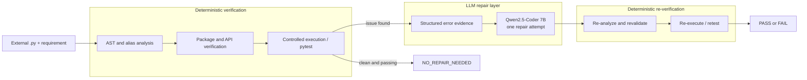

# Dependency-Aware Hallucination Detection and Repair for LLM-Generated Python Code

[中文说明](README_CN.md)

An AI/LLM engineering system that accepts external Python code, deterministically checks its dependencies and API usage, executes it with an optional unit test, and sends structured failure evidence to a local Qwen2.5-Coder 7B model for one repair attempt. The repaired program is then revalidated and re-executed before the CLI reports `PASS`, `FAIL`, or `NO_REPAIR_NEEDED`.

The project does not claim academic novelty, state-of-the-art performance, or a production-grade security sandbox. Its controlled dataset and historical 0.5B LoRA experiments establish feasibility; the current user-facing repair backend is Qwen2.5-Coder 7B through Ollama.

## Problem

A valid package import does not imply valid API usage. LLM-generated Python can contain:

- nonexistent packages or submodules;
- nonexistent functions, classes, methods, or attributes;
- incorrect argument names or counts;
- runtime errors despite valid imports and APIs; and
- functionally incorrect output that only a test can expose.

Asking another LLM whether an API exists simply moves the hallucination problem. This system instead uses Python AST analysis, import metadata, runtime resolution, reflection, conservative signature binding, controlled execution, and pytest evidence. The LLM is used for repair only after deterministic evidence has been collected.

## Final System



When `--code-file` is supplied, no generator model is constructed. A repair is triggered by invalid package/API evidence or, in the engineering CLI workflow, failed execution/test evidence. The pipeline makes at most one model call, then returns the post-repair evidence even if the repair still fails.

## CLI Quick Start

Install the Python project and ensure Ollama is running with the exact local tag:

```bash
python -m pip install -e ".[dev]"
ollama pull qwen2.5-coder:7b
```

Run the included harmless external-file repair example:

```powershell
python -m depguard.cli run --config configs/engineering_7b_ollama.yaml --requirement "Compute the arithmetic mean of 2, 5, and 8 and expose it as result." --code-file data/engineering_sanity/cases/function_statistics_average/input.py --test-file data/engineering_sanity/cases/function_statistics_average/test_input.py --output results/demo_result.json
```

The CLI prints the complete JSON result and optionally writes it to `--output`. Important fields include:

- `generated_code`: the original supplied code;
- `package_results` and `api_results`: initial deterministic findings;
- `execution_result`: initial execution or pytest evidence;
- `repair_attempted` and `repaired_code`;
- `repaired_package_results`, `repaired_api_results`, and `repaired_execution_result`;
- `repair_backend_metadata`: Ollama latency/token metadata when repair ran; and
- `final_status`.

| Serialized `final_status` | Meaning |
| --- | --- |
| `PASS` | A repair was attempted and the repaired code passed validation and execution/test. |
| `FAIL` | The final code failed validation or execution/test. Failure evidence remains in the JSON. |
| `NO_REPAIR_NEEDED` | The original code passed without a repair. This is a successful outcome, not a failure. |

The original source and test files are never modified. The CLI also rejects a JSON `--output` path that matches either input file. Repaired code is returned inside the result JSON; automatic in-place editing is intentionally unsupported.

## Model Strategy

The model path evolved for engineering reasons:

1. Build the deterministic detection, evidence, repair, and revalidation pipeline.
2. Use Qwen2.5-Coder 0.5B on CPU for inexpensive controlled feasibility experiments.
3. Train LoRA adapters to verify that task-specific adaptation improves a weak small-model baseline.
4. Move the practical repair workflow to generic Qwen2.5-Coder 7B through Ollama.
5. Stop training: the generic 7B already solves most triggered repairs, so 7B LoRA/QLoRA is not currently justified.

The 0.5B/LoRA path remains valuable evidence of Hugging Face Transformers, PyTorch, PEFT, dataset construction, leakage-safe splitting, validation-only checkpoint selection, and failure analysis. It is not required by the final CLI.

## Controlled Evaluation

The held-out evaluation contains 168 corrupted programs plus 42 valid controls. The supplied buggy candidates, repair prompt, unit tests, seed, and 64-token output cap were fixed; the API-aware repair conditions also shared the same detector and one-shot trigger policy. The raw condition performs no repair.

| Condition | Final syntax valid | Final execution / unit test | Successful attempted repairs | All required repairs |
| --- | ---: | ---: | ---: | ---: |
| Raw candidate | 210/210 | 42/210 | n/a | 0/168 |
| 0.5B API-aware generic | 144/210 | 77/210 | 35/160 | 35/168 |
| 0.5B API-aware LoRA | 202/210 | 127/210 | 85/160 | 85/168 |
| **7B API-aware generic** | **210/210** | **197/210** | **155/160** | **155/168** |

All 42 valid controls were preserved by the 7B condition without unnecessary repair. Package detection recorded TP 24, FP 0, FN 0; API detection recorded TP 136, FP 0, FN 8.

This table is practical engineering evidence, not a strict model-size ablation. The historical 0.5B conditions used Hugging Face, FP32, and CPU execution. The 7B condition used Ollama, GGUF Q4_K_M quantization, and full GPU residency reported by Ollama. Backend, precision, placement, and model capacity changed together.

## Engineering Sanity Evaluation

A separate **small engineering sanity set** exercises the real external-file CLI. It contains ten manually prepared cases with explicit provenance and executable tests; it is not presented as a statistically representative real-world benchmark.

- Six cases exercise direct package/API findings.
- One incorrect JSON keyword is caught by execution even though static API verification misses it.
- One API-valid but functionally wrong program is caught only by its unit test.
- Eight repair-triggered cases passed after exactly one 7B repair.
- Two correct controls returned `NO_REPAIR_NEEDED` and did not invoke Ollama.
- Frozen SHA-256 checks confirmed every source/test input remained unchanged.

See the [case-level engineering report](results/engineering_sanity_7b_ollama/engineering_report.md), [machine-readable report](results/engineering_sanity_7b_ollama/engineering_report.json), and [run manifest](results/engineering_sanity_7b_ollama/run_manifest.json).

## Failure Analysis

The 7B controlled run ended with 13 failures:

- **8 detector misses:** incorrect `datetime.datetime.isoformat` keyword arguments were not inspectable through the current reflection path, so repair was never triggered.
- **5 attempted repair failures:** one wrong JSON value shape, one unresolved `fractions` class, and three repeated NumPy broadcasting/list-concatenation errors.

All 160 repaired outputs were syntactically valid. The largest single remaining failure source is detector coverage, not repair-model capacity. Full artifacts are in [the 7B controlled result directory](results/controlled_api_repair_7b_ollama/test).

## Why No 7B LoRA or QLoRA

Generic 7B repaired 155/160 attempted cases in the controlled evaluation and 8/8 triggered cases in the engineering sanity set. Fine-tuning cannot fix the eight cases where the detector never invokes the model, and only five controlled failures remained after an actual model call. Given the additional training cost and evaluation burden, current evidence does not justify 7B adaptation. It remains an option only if broader genuine external workloads later reveal a repeated repair failure pattern.

## Architecture and Implementation

- **AST analysis:** imports, aliases, API references, receiver types, call forms, arguments, and syntax errors.
- **Package verification:** installed import metadata and importability in the current environment.
- **API verification:** module/object resolution, reflection, close suggestions, and conservative signature checks.
- **Execution/test:** temporary subprocess execution with timeouts and optional pytest code.
- **Structured repair context:** requirement, original code, detector evidence, suspicious reference, candidate APIs, and runtime traceback.
- **Ollama backend:** stdlib HTTP client for local one-shot Qwen2.5-Coder 7B repair.
- **Hugging Face path:** configurable causal generation/repair for the historical controlled experiments.
- **LoRA path:** PEFT adapters and validation-selected historical checkpoints.
- **Artifact layer:** raw rows, summaries, resolved configs, hashes, manifests, latency metadata, and failure reports.

Primary modules are under `src/depguard/`; dataset/training utilities are under `training/`; controlled evaluation utilities are under `evaluation/`.

## Historical 0.5B and LoRA Evidence

The expanded catalog contains 70 templates with eight variants each: 560 validated corruption/target pairs across 20 library/module families. Template/API-disjoint splitting produced 280 training, 112 validation, and 168 held-out corrupted rows; the final test benchmark adds 42 valid controls.

Three one-epoch CPU LoRA experiments compared data size and adapter rank:

| Experiment | Train rows | Rank / alpha | Validation repairs |
| --- | ---: | ---: | ---: |
| Small R4 | 112 | 4 / 8 | 32/112 |
| Full R4 | 280 | 4 / 8 | 53/112 |
| Full R8 | 280 | 8 / 16 | 62/112 |

Full R8 was selected using validation execution/unit-test performance before test evaluation. The selected adapter has 540,672 trainable parameters. Exact split fingerprints, training manifests, metrics, selection evidence, and historical case-level results remain preserved under `results/controlled_api_repair_v2/`.

## Reproducibility

| Purpose | Config / artifact |
| --- | --- |
| External-file 7B CLI | [`configs/engineering_7b_ollama.yaml`](configs/engineering_7b_ollama.yaml) |
| 7B controlled evaluation | [`configs/evaluation_7b_ollama.yaml`](configs/evaluation_7b_ollama.yaml) |
| 7B raw rows, summary, manifest, failures | [`results/controlled_api_repair_7b_ollama/test`](results/controlled_api_repair_7b_ollama/test) |
| Engineering sanity cases | [`data/engineering_sanity/manifest.json`](data/engineering_sanity/manifest.json) |
| Engineering sanity results | [`results/engineering_sanity_7b_ollama`](results/engineering_sanity_7b_ollama) |
| Historical 0.5B/LoRA experiment | [`results/controlled_api_repair_v2`](results/controlled_api_repair_v2) |
| Historical selected evaluation config | [`configs/evaluation_expanded_selected.yaml`](configs/evaluation_expanded_selected.yaml) |

Recorded practical model identity:

- tag: `qwen2.5-coder:7b`
- Ollama digest: `dae161e27b0e90dd1856c8bb3209201fd6736d8eb66298e75ed87571486f4364`
- format/family: GGUF / Qwen2
- parameter size: 7.6B
- quantization: Q4_K_M
- Ollama version: 0.32.5
- controlled-run requested/runtime context: 4,096 tokens
- environment: Windows, Python 3.13.8; Ollama reported full GPU placement

The final 7B manifests record dataset/config SHA-256 values, resolved configuration, environment, timestamp, model identity, and runtime metadata. Historical data, selected adapters, and 7B outputs are not regenerated during ordinary CLI use.

## Verification

```bash
python -m pytest
python -m ruff check .
git diff --check
```

The automated suite covers AST analysis, verification, execution classification, repair orchestration, Ollama request/error handling, config-driven backend selection, benchmark metrics, leakage-safe splitting, CLI test-file behavior, final-status semantics, and source-file safety.

## Limitations

- The system primarily targets Python and single-file tasks, not complex multi-file repositories.
- Reflection may miss dynamic attributes, monkey patches, lazy exports, optional dependencies, and C-extension signatures.
- Package validity depends on the current installed environment.
- API existence does not prove semantic correctness; meaningful requirements and tests remain important.
- Functional correctness is only as strong as the supplied test or observable task evaluation.
- The Windows subprocess runner is a timeout/process boundary, not a hardened production sandbox for untrusted code.
- Eight controlled API corruptions were missed by the current detector.
- The engineering sanity set is small and manually prepared.
- The controlled corruption distribution differs from naturally occurring production LLM output.
- Repair is intentionally one-shot; a failed repair is reported rather than automatically retried.

## Future Work

- Evaluate a broader, genuinely external set of LLM-generated Python programs.
- Improve detector coverage for difficult signatures and dynamic APIs.
- Use stronger OS/container isolation before executing untrusted code in production.
- Add multi-file/repository context only if future users require it.
- Reconsider 7B adaptation only if a future workload demonstrates a repeated, measurable model-side gap.

For an interview-oriented overview, see [`docs/PROJECT_SUMMARY.md`](docs/PROJECT_SUMMARY.md).
