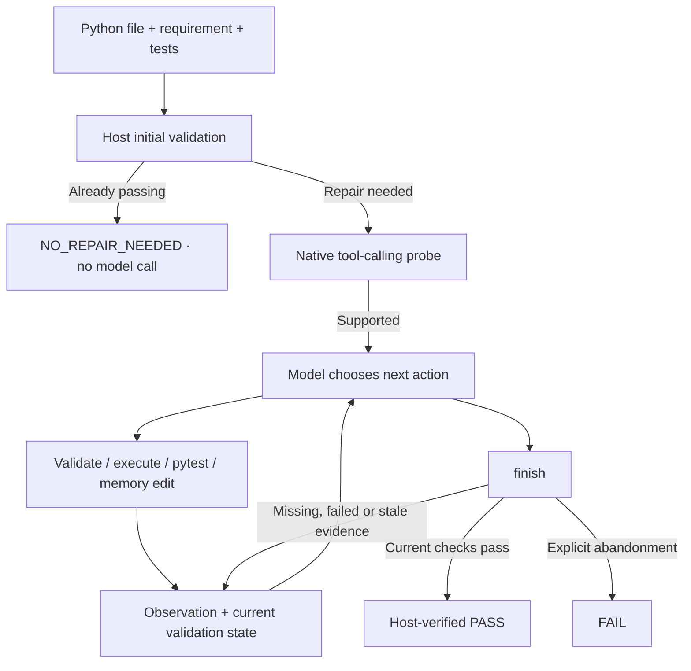

# Dependency-Aware Codegen

[中文说明](README_CN.md)

A Python code-repair project that evolved from dependency-aware validation and small-model experiments into an observation-driven Agent loop. The model chooses tools and edits; the host controls permissions, candidate versions, formal validation and the final verdict.

The current system targets **single-file Python repair** with local Ollama models. The original one-shot workflow remains available as a regression and evaluation baseline.

The current Agent passed **192/200 (96%)** fixed defect tasks. After freezing the implementation, it passed both visible checks and held-out acceptance on **93/100 additional tasks** not used in prior project development. These evaluations are reported separately below.

## Why this project exists

LLM-generated Python may import nonexistent packages, call invalid APIs, use incorrect arguments, fail at runtime, or produce the wrong result despite valid syntax. Asking another model whether the code is correct only moves the uncertainty.

This project combines deterministic AST/package/API checks, execution and pytest evidence with model-based repair. A model proposes actions, but only host-side evidence can establish `PASS`.

## Project evolution

The work followed one continuous engineering path rather than starting directly with a large Agent:

| Stage | Goal and outcome |
| --- | --- |
| **0.5B feasibility baseline** | Built the dataset, deterministic validation pipeline and controlled repair evaluation with a small CPU-friendly code model. This established that structured dependency/API evidence could improve repair prompts, while also exposing the limits of a weak base model. |
| **0.5B LoRA adaptation** | Fine-tuned the small model with PEFT/LoRA using leakage-aware train/validation/test splits. Execution/test passes improved from **77/210** for the generic 0.5B condition to **127/210** for the selected LoRA condition. |
| **7B engineering workflow** | Moved from an experiment-oriented model to local Qwen2.5-Coder 7B through Ollama, then built an external-file CLI with deterministic triggering, structured evidence, one repair attempt and host revalidation. It reached **197/210** on the controlled set and **8/8 repairs + 2/2 controls** on the engineering sanity set. |
| **30B Agent loop** | Upgraded to Qwen3-Coder 30B with native tool calling, memory patches, repeated validation and host-controlled finish. Historical M7.2 passed **15/15**, including **1/1 strict multi-turn rescue** and **5/5 unchanged controls**; these development-exposed cases are now retained as regression tests. |

The historical experiments show how the project reached its current design; they are not a claim that model size, fine-tuning and Agent architecture were isolated in one controlled ablation. Backends, model sizes and evaluation sets changed across stages.

## Current Agent loop


```mermaid
flowchart TD
    A[Python file + requirement + tests] --> B[Host initial validation]
    B -- Already passing --> C[NO_REPAIR_NEEDED · no model call]
    B -- Repair needed --> D[Native tool-calling probe]
    D -- Supported --> E[Model chooses next action]
    E --> F[Validate / execute / pytest / memory edit]
    F --> G[Observation + current validation state]
    G --> E
    E --> H[finish]
    H -- Missing, failed or stale evidence --> G
    H -- Current checks pass --> I[Host-verified PASS]
    H -- Explicit abandonment --> J[FAIL]
```

The loop has several deliberate boundaries:

- **Model-selected strategy:** the model chooses package/API validation, execution, pytest, `apply_patch`, `replace_candidate`, rollback or finish. The host does not impose a fixed repair sequence.
- **Evidence-based completion:** every accepted edit creates a new candidate version and invalidates old checks. A premature success finish becomes `FINISH_PRECONDITION_FAILED`, allowing the model to continue.
- **Safe-by-default edits:** unified diffs and complete-code replacements update the in-memory candidate atomically after syntax checks. Disk writes require explicit `--apply` and a verified PASS; snapshots precede writes, and failed post-write validation triggers a rollback attempt.
- **Bounded context and runtime:** the host limits steps, total time, protocol errors and repeated no-progress actions. Full tool output remains in the artifact while model-visible observations are compacted.
- **Tool-boundary checks:** permissions, path scope, source/test hashes and conservative AST risk analysis are checked before sensitive operations.

## Quick start

Requirements: Python 3.10+, Ollama and a model with native tool calling.

```powershell
python -m pip install -e ".[dev]"
ollama pull qwen3-coder:30b
```

Save the following as `agent.local.json`:

```json
{
  "agent": {
    "provider": "ollama",
    "max_steps": 24,
    "timeout_seconds": 300,
    "ollama": {
      "model_name": "qwen3-coder:30b",
      "base_url": "http://localhost:11434",
      "context_length": 16384,
      "max_new_tokens": 2048,
      "temperature": 0,
      "keep_alive": "10m"
    }
  }
}
```

Run the bundled example:

```powershell
python -m depguard.cli agent --config agent.local.json --project-root . --code-file examples/m5/input.py --test-file examples/m5/test_input.py --requirement "Return three as result." --output results/agent_demo.json
```

Replace the paths and requirement with your own task. Formal tests are supplied by the user and remain read-only. `--project-root` defines the accessible project boundary.

The default is dry-run: the candidate and trajectory are returned in JSON without changing the source file. Add `--apply` only when you want a host-verified candidate written back. Important output fields include:

- `final_status` and `termination_reason`;
- `agent_invoked`, `capability_probe` and `finish_verification`;
- `candidate_code`, revision/hash-based `candidate_version` and normalized diff;
- current validation evidence and the complete tool trajectory;
- persistence, snapshot and rollback outcomes when `--apply` is used.

Correct inputs return `NO_REPAIR_NEEDED` without invoking the repair model. Triggered runs distinguish `PASS`, `FAIL`, `INCOMPLETE` and `ERROR`. Trajectories store short public decision summaries, not hidden model reasoning.

The legacy one-shot workflow remains available:

```powershell
python -m depguard.cli run --config configs/engineering_7b_ollama.yaml --requirement "Compute the arithmetic mean of 2, 5, and 8 as result." --code-file data/engineering_sanity/cases/function_statistics_average/input.py --test-file data/engineering_sanity/cases/function_statistics_average/test_input.py --output results/one_shot_demo.json
```

For a model-free Agent demonstration, use `configs/m5_scripted.json`. It drives real tools with scripted decisions and is useful for testing orchestration, but it is excluded from model-quality metrics.

## Improving Agent edits: a fixed 200-task retest

Trajectory analysis identified patch formatting and context matching as recurring obstacles to applying repairs. The Agent can now choose `replace_candidate` to submit complete single-file code, alongside `apply_patch`. Replacement must match the current candidate version; empty, unchanged, stale or syntactically invalid submissions are rejected. Accepted edits still require revalidation and do not write the source by default.

With the same tasks, tests, local 30B model and parameters:

| Metric | Previous Agent | Updated Agent |
| --- | ---: | ---: |
| Confirmed validation passes | 134/200 (67%) | **192/200 (96%)** |
| Observed nonpasses | 63 | 8 |
| Interrupted outcomes unknown | 3 | 0 |
| Separate correct-code samples preserved | 20/20 | 20/20 |

The confirmed pass proportion increased by **29 percentage points**. Case-level comparison found 58 improvements and 3 regressions; previously unknown outcomes remain separate from failures. The updated Agent made 261 complete-replacement calls, of which 228 were accepted. Edit acceptance is not task success.

These 200 tasks informed the improvement and remain a development/regression evaluation, not independent generalization evidence. Complete replacement reduces formatting overhead but still has output-length, unintended-edit and model-error limitations.

## Independent evaluation: 100 new tasks with held-out acceptance

The updated Agent code and model parameters were frozen before selecting **80 synthetic bug mutations of MBPP programming contracts and 20 authored standard-library scenarios** under predefined rules. Tasks had not been used in prior project development and were checked for historical and within-set duplicates. Defective inputs had to fail both test partitions, while references had to pass. Inputs, tests, provenance and SHA-256 hashes were fixed before repair-model inference; neither Agent behavior nor case inclusion changed during the run.

The evaluation separated **128 model-visible assertions** from **222 held-out assertions**, with no overlap. Held-out acceptance ran on the final candidate after the Agent stopped; its results were not fed back for further repair.

| Metric | Result |
| --- | ---: |
| Visible host checks passed | 96/100 |
| Held-out acceptance passed | 94/100 |
| **Normal completion and both validations passed** | **93/100 (93%)** |
| MBPP synthetic mutations: final passes | 73/80 |
| Authored standard-library scenarios: final passes | 20/20 |

Three tasks passed visible checks but failed held-out acceptance. One passed held-out acceptance but exhausted its step budget without normal completion; it was not counted as success. All 100 outcomes were recorded, including failures, refusals and budget exhaustion.

Both evaluations used local **Qwen3-Coder 30B / Ollama 0.34.4**, context 16384, temperature 0, seed 42, at most 24 steps and a 300-second task budget. Final audits and held-out acceptance have separate time allowances. Model digest: `06c1097efce0431c2045fe7b2e5108366e43bee1b4603a7aded8f21689e90bca`.

These are controlled single-file tasks. Synthetic bugs are not production incidents, and public benchmarks may overlap pretraining data; hiding tests from this repair session does not establish pretraining novelty. **The 96% and 93% results are not pooled into a general or production repair rate.** Human acceptance was not measured.

Local evidence: `results/candidate_replace_v1/` and `results/holdout100_v1/`, containing case records, statistics and reports. Independent-task inputs and tests are in `data/holdout100_v1/`; the evaluator is `scripts/holdout100_run.py`. Some result directories are ignored by default; if they are not distributed with the repository, generate them locally or obtain the evidence separately.

## Historical baseline: 200 single-file defect tasks

The following preserves results before the edit-tool improvement, not the current Agent pass counts. The same local Qwen3-Coder 30B was evaluated with one-shot repair and the previous Agent on **200 frozen defect tasks**. Correct-code samples are excluded from this count. Sources, inputs, tests and configurations are recorded; every outcome, including interruptions, is retained.

| Source | Defects | One-shot passes | Agent passes | Agent outcomes unknown |
| --- | ---: | ---: | ---: | ---: |
| QuixBugs public algorithm defects | 29 | 25 | 22 | 1 |
| Public library defect adaptations | 4 | 3 | 2 | 1 |
| HumanEvalPack public authored bugs | 100 | 95 | 63 | 1 |
| Authored general scenarios | 36 | 27 | 27 | 0 |
| Authored API scenarios | 31 | 29 | 20 | 0 |

HumanEvalPack contains human-inserted bugs, not production incidents. Project-authored tasks are also synthetic. Public benchmarks may appear in training data; this historical evaluation exposed formal tests and did not measure held-out acceptance or human acceptance. These groups are not pooled into a production success rate.
The Agent is not assumed to outperform one-shot repair. Reports retain paired outcomes, strict multi-round rescues, patch rejection reasons and measured costs. Twenty related correct-code samples in the earlier batches remained unchanged; they are separate from the 200 defects.

[Complete task index](results/expansion200_v1/coverage_200.json) · [131-task extension report](results/expansion200_v1/report.md) · [Statistics](results/expansion200_v1/summary.json) · [Earlier public benchmark](results/external_eval_v1/report.md) · [Earlier mixed-source report](results/horizontal_eval_v1/report.md)

## Historical Agent evaluation (M7.2)

The M7.2 comparison used the same Qwen3-Coder 30B digest, parameters, requirements, source files and formal tests for one-shot and Agent conditions. The 15 one-shot artifacts were reused unchanged for that Agent retest. These cases informed development and are not an independent test of generalization.

| Metric | Result |
| --- | ---: |
| One-shot final pass | 14/15 |
| Agent final pass, including unchanged controls | 15/15 |
| Strict multi-turn rescues | 1/1 |
| Controls preserved without model calls | 5/5 |
| Native protocol success on triggered repairs | 10/10 |
| False success outcomes | 0/15 |
| Permission refusals / rollback checks | 5/5 · 1/1 |

In `weights`, the first patch still failed pytest; the model read the new failure, applied a different patch and passed. In `runs`, a premature finish was rejected, after which the model selected the missing checks and finished successfully.

The strict-rescue denominator is only one, and the cases are small, manually prepared and test-visible. These results demonstrate a working, auditable loop—not broad superiority over general coding agents. Average latency also increased from 19.392 to 27.119 seconds compared with the preceding Agent version.

[Final report](results/m72/report.md) · [Machine-readable summary](results/m72/summary.json)

## Architecture and repository layout

- `src/depguard/analysis/`, `verification/`: AST, dependency and API analysis.
- `src/depguard/execution/`: subprocess execution and pytest evidence.
- `src/depguard/agent/`: trigger gate, state machine, tool registry, patching, validation state and persistence.
- `src/depguard/models/`: Ollama/cloud native tool adapters and the scripted test provider.
- `training/`: historical dataset, Transformers and LoRA utilities.
- `evaluation/`, `data/`, `results/`: frozen cases, evaluators, manifests and auditable artifacts.

The evolution table above summarizes the earlier experiments. Supplementary documentation stays in the local `docs/` directory and is not distributed with the repository.

## Verification and limitations

```powershell
python -m pytest
python -m ruff check --no-cache .
```

Latest full Agent verification: **261 passed, 1 skipped**, plus **6 independent-evaluation helper tests passed**. The skip is due to Windows symlink permissions; ruff passed.

The current scope is single-file Python repair, not autonomous repository-wide development. Correctness depends on formal test quality and validator coverage. Static risk analysis and regression checks are conservative heuristics. Subprocesses, temporary directories and timeouts provide process/time boundaries, **not a hardened security sandbox for untrusted code**. Real public deployment would require stronger isolation, authentication, resource limits and task scheduling.
