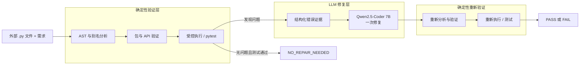

# 面向 LLM 生成 Python 代码的依赖感知幻觉检测与修复

这是一个面向实际工程流程的 AI/LLM 项目：用户可以提交外部 Python 文件，系统以确定性方式检查依赖与 API、运行代码及可选单元测试，并把结构化失败证据交给本地 Qwen2.5-Coder 7B 进行一次修复。修复代码随后会重新验证和执行，CLI 最终返回 `PASS`、`FAIL` 或 `NO_REPAIR_NEEDED`。

本项目不主张学术创新、SOTA 性能或生产级安全沙箱。受控数据集和历史 0.5B LoRA 实验用于证明方案可行；当前面向用户的修复后端是通过 Ollama 运行的 Qwen2.5-Coder 7B。

## 问题

包可以导入，并不代表 API 使用正确。LLM 生成的 Python 代码可能包含：

- 不存在的包或子模块；
- 不存在的函数、类、方法或属性；
- 错误的参数名或参数数量；
- 包与 API 合法但仍发生的运行时错误；
- 只有单元测试才能发现的功能错误。

如果再询问另一个 LLM 某个 API 是否存在，只是转移了幻觉问题。本系统使用 Python AST、导入元数据、运行时解析、反射、保守签名绑定、受控执行和 pytest 证据完成验证；LLM 只在获得确定性证据后负责修复。

## 最终系统



提供 `--code-file` 后不会构造代码生成模型。工程 CLI 会在发现无效包/API 或执行/测试失败时触发修复。每个输入最多调用模型一次；即使修复失败，系统也会直接返回修复后的验证与执行证据，不会自动进行第二轮修复。

## CLI 快速开始

安装项目，并确保 Ollama 中存在准确的模型标签：

```bash
python -m pip install -e ".[dev]"
ollama pull qwen2.5-coder:7b
```

运行仓库中无害的外部文件修复示例：

```powershell
python -m depguard.cli run --config configs/engineering_7b_ollama.yaml --requirement "Compute the arithmetic mean of 2, 5, and 8 and expose it as result." --code-file data/engineering_sanity/cases/function_statistics_average/input.py --test-file data/engineering_sanity/cases/function_statistics_average/test_input.py --output results/demo_result.json
```

CLI 会打印完整 JSON，也可以通过 `--output` 保存。关键字段包括原始代码、初始包/API 发现、初始执行证据、是否触发修复、修复代码、修复后验证/执行结果、Ollama 延迟元数据和 `final_status`。

| `final_status` | 实际含义 |
| --- | --- |
| `PASS` | 已执行一次修复，修复代码通过验证和执行/测试。 |
| `FAIL` | 最终代码未通过验证或执行/测试；JSON 中保留失败证据。 |
| `NO_REPAIR_NEEDED` | 原始代码无需修复且直接通过。这是成功结果，不是失败。 |

系统不会修改原始源文件和测试文件。如果 JSON `--output` 与任一输入文件路径相同，CLI 会拒绝执行。修复代码只返回在结果 JSON 中，不支持自动原地覆盖。

## 模型策略

模型路线服务于工程验证：

1. 先构建确定性的检测、证据、修复、重新验证流水线。
2. 使用 Qwen2.5-Coder 0.5B 在 CPU 上低成本验证受控方案。
3. 训练 LoRA，确认任务适配能改善较弱的小模型修复基线。
4. 将实际 CLI 修复模型升级为 Ollama 上的通用 Qwen2.5-Coder 7B。
5. 停止继续训练：通用 7B 已解决绝大多数被触发的修复，当前没有足够证据支持 7B LoRA/QLoRA 的成本。

历史 0.5B/LoRA 路线仍展示了 Hugging Face Transformers、PyTorch、PEFT、数据集构建、防泄漏划分、仅基于验证集选择检查点和失败分析，但最终 CLI 不依赖该小模型或适配器。

## 受控评估

留出评估包含 168 个破坏程序和 42 个正确对照。所有条件共享同一批错误候选代码、检测器行为、修复提示、单元测试、单轮触发策略和 64 token 输出上限。

| 条件 | 最终语法有效 | 最终执行 / 单元测试 | 成功修复尝试 | 所有需要修复的样本 |
| --- | ---: | ---: | ---: | ---: |
| 原始候选代码 | 210/210 | 42/210 | 不适用 | 0/168 |
| 0.5B API 感知通用模型 | 144/210 | 77/210 | 35/160 | 35/168 |
| 0.5B API 感知 LoRA | 202/210 | 127/210 | 85/160 | 85/168 |
| **7B API 感知通用模型** | **210/210** | **197/210** | **155/160** | **155/168** |

7B 条件保留了全部 42 个正确对照，且没有多余修复。包检测结果为 TP 24、FP 0、FN 0；API 检测结果为 TP 136、FP 0、FN 8。

该表是实际工程系统证据，不是严格的模型规模单变量消融。历史 0.5B 条件使用 Hugging Face、FP32 和 CPU；7B 条件使用 Ollama、GGUF Q4_K_M 量化，并由 Ollama 报告为完全驻留 GPU。后端、精度、硬件位置和模型容量同时发生了变化。

## 工程健全性评估

独立的**小型工程健全性集合**用于验证真实外部文件 CLI。它包含 10 个明确标注为人工准备的短程序及可执行测试，不应被称为具有统计代表性的真实世界基准。

- 6 个案例直接触发包/API 发现；
- 1 个错误 JSON 关键字没有被静态验证发现，但被执行阶段捕获；
- 1 个 API 合法但功能错误的程序只被单元测试发现；
- 8 个需修复案例均在一次 7B 修复后通过；
- 2 个正确对照均返回 `NO_REPAIR_NEEDED`，且没有调用 Ollama；
- 冻结的 SHA-256 证明所有输入源文件和测试文件均未变化。

详见[工程评估报告](results/engineering_sanity_7b_ollama/engineering_report.md)、[机器可读报告](results/engineering_sanity_7b_ollama/engineering_report.json)和[运行清单](results/engineering_sanity_7b_ollama/run_manifest.json)。

## 失败分析

7B 受控评估共有 13 个最终失败：

- **8 个检测器漏检：**当前反射路径无法检查 `datetime.datetime.isoformat` 的错误关键字参数，因此没有触发修复。
- **5 个已尝试修复但失败：**1 个 JSON 值形状错误、1 个未解决的 `fractions` 类，以及 3 个重复的 NumPy 广播/列表拼接错误。

160 个修复输出全部语法有效。目前最大的单一失败来源是检测器覆盖率，而不是修复模型容量。完整证据位于 [7B 受控结果目录](results/controlled_api_repair_7b_ollama/test)。

## 为什么不训练 7B LoRA / QLoRA

通用 7B 在受控评估中成功修复 155/160 个已尝试案例，在工程健全性集合中修复 8/8 个触发案例。微调无法解决检测器根本没有调用模型的 8 个案例，而真正调用模型后只剩 5 个受控失败。考虑额外训练和评估成本，当前证据不支持 7B 适配；只有未来更广泛的真实外部工作负载出现可重复的模型侧失败模式时，才值得重新评估。

## 架构与实现

- **AST 分析：**导入、别名、API 引用、接收者类型、调用形式、参数和语法错误。
- **包验证：**当前环境中的导入元数据和实际可导入性。
- **API 验证：**模块/对象解析、反射、近似候选和保守签名检查。
- **执行/测试：**带超时的临时子进程和可选 pytest 代码。
- **结构化修复上下文：**需求、原始代码、检测证据、可疑引用、候选 API 和运行时回溯。
- **Ollama 后端：**使用标准库 HTTP 客户端调用本地 7B 并进行一次修复。
- **Hugging Face 路线：**用于历史受控生成与修复实验。
- **LoRA 路线：**PEFT 适配器和基于验证集选择的历史检查点。
- **制品层：**原始记录、汇总、解析配置、哈希、清单、延迟元数据和失败报告。

主要系统模块位于 `src/depguard/`，数据/训练工具位于 `training/`，受控评估工具位于 `evaluation/`。

## 历史 0.5B 与 LoRA 证据

扩展目录包含 70 个模板，每个模板 8 个变体，共 560 对经过验证的破坏/目标代码，覆盖 20 个库或模块系列。按模板/API 隔离的划分生成 280 个训练、112 个验证和 168 个留出破坏样本；最终测试基准另加 42 个正确对照。

| 实验 | 训练行数 | Rank / alpha | 验证修复 |
| --- | ---: | ---: | ---: |
| Small R4 | 112 | 4 / 8 | 32/112 |
| Full R4 | 280 | 4 / 8 | 53/112 |
| Full R8 | 280 | 8 / 16 | 62/112 |

项目在查看测试结果之前，根据验证集执行/单元测试表现选择 Full R8。该适配器含 540,672 个可训练参数。划分指纹、训练清单、指标、选择证据和历史逐案例结果均保留在 `results/controlled_api_repair_v2/`。

## 可复现性

| 用途 | 配置 / 制品 |
| --- | --- |
| 外部文件 7B CLI | [`configs/engineering_7b_ollama.yaml`](configs/engineering_7b_ollama.yaml) |
| 7B 受控评估 | [`configs/evaluation_7b_ollama.yaml`](configs/evaluation_7b_ollama.yaml) |
| 7B 原始记录、汇总、清单、失败分析 | [`results/controlled_api_repair_7b_ollama/test`](results/controlled_api_repair_7b_ollama/test) |
| 工程健全性案例 | [`data/engineering_sanity/manifest.json`](data/engineering_sanity/manifest.json) |
| 工程健全性结果 | [`results/engineering_sanity_7b_ollama`](results/engineering_sanity_7b_ollama) |
| 历史 0.5B/LoRA 实验 | [`results/controlled_api_repair_v2`](results/controlled_api_repair_v2) |

最终工程模型记录：

- 标签：`qwen2.5-coder:7b`
- Ollama digest：`dae161e27b0e90dd1856c8bb3209201fd6736d8eb66298e75ed87571486f4364`
- 格式/系列：GGUF / Qwen2
- 参数量：7.6B
- 量化：Q4_K_M
- Ollama：0.32.5
- 受控运行请求/实际上下文：4,096 token
- 环境：Windows、Python 3.13.8；Ollama 报告模型完全驻留 GPU

## 验证

```bash
python -m pytest
python -m ruff check .
git diff --check
```

自动化测试覆盖 AST 分析、包/API 验证、执行分类、修复编排、Ollama 请求和错误处理、配置驱动的后端选择、评估指标、防泄漏划分、CLI 测试文件、最终状态语义和源文件安全。

## 局限性

- 主要目标是 Python 单文件任务，不是复杂的多文件仓库。
- 反射可能漏检动态属性、猴子补丁、惰性导出、可选依赖和 C 扩展签名。
- 包有效性依赖当前安装环境。
- API 存在不等于语义正确；需求和测试仍然重要。
- 功能正确性受限于用户提供的测试或可观察任务评估。
- Windows 子进程执行器只提供超时/进程边界，不是用于不可信代码的生产级强化沙箱。
- 当前检测器在受控评估中漏掉 8 个 API 错误。
- 工程健全性集合规模小且由人工准备。
- 受控破坏分布不同于生产环境中的自然 LLM 输出。
- 修复刻意保持单轮；失败会被报告而不是自动重试。

## 未来工作

- 评估更广泛、真正外部来源的 LLM 生成 Python 程序。
- 针对难检查的签名和动态 API 改进检测覆盖率。
- 在生产执行不可信代码前使用更强的 OS/容器隔离。
- 仅在用户确有需求时增加多文件/仓库上下文。
- 仅当未来工作负载证明存在重复且可测量的模型侧缺口时，重新考虑 7B 适配。

面试准备可参考 [`docs/PROJECT_SUMMARY.md`](docs/PROJECT_SUMMARY.md)。英文说明见 [`README.md`](README.md)。
