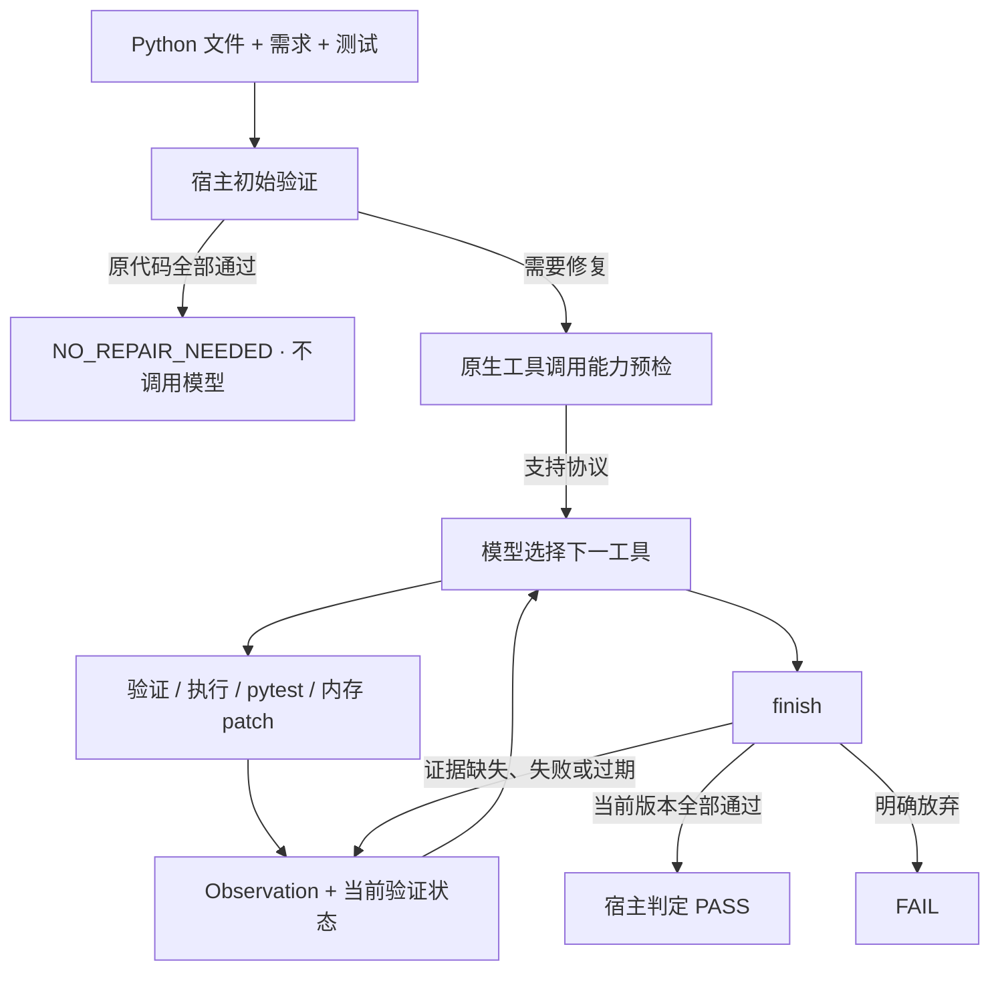

# Dependency-Aware Codegen

[English](README.md)

一个基于依赖检查、代码执行和 pytest 反馈的 Python 修复 Agent。模型负责选择工具和修改代码，宿主负责权限、候选版本、验证证据与最终判定。

项目重点是 **由 observation 驱动的 Agent loop**，已使用本地 Ollama + Qwen3-Coder 30B 完成真实验证。原有单次修复流程保留为回归与评估基线。

## Agent loop 如何工作



- **模型自主选择动作**：包/API 验证、执行、pytest、`apply_patch`、rollback 和 finish，不预设固定修复顺序。
- **以真实证据结束**：patch 后旧检查失效；提前声明成功会被作为 observation 返回，模型可以继续行动，不能靠声明绕过验证。
- **运行有明确上限**：步数、全局超时、协议错误和重复动作限制防止失控；完整工具输出保留，模型上下文有长度限制。
- **修改受工具边界约束**：patch 原子应用到内存候选，工具调用受输入哈希、路径权限和 AST 风险检查约束。

## 快速开始

安装 Python 3.10+ 和 Ollama，在仓库根目录执行：

```powershell
python -m pip install -e ".[dev]"
ollama pull qwen3-coder:30b
```

将以下 CLI 配置保存为 `agent.local.json`：

```json
{
  "agent": {
    "provider": "ollama",
    "max_steps": 24,
    "timeout_seconds": 300,
    "ollama": {
      "model_name": "qwen3-coder:30b",
      "base_url": "http://localhost:11434",
      "context_length": 16384,
      "max_new_tokens": 2048,
      "temperature": 0,
      "keep_alive": "10m"
    }
  }
}
```

运行仓库自带的修复示例：

```powershell
python -m depguard.cli agent --config agent.local.json --project-root . --code-file examples/m5/input.py --test-file examples/m5/test_input.py --requirement "Return three as result." --output results/agent_demo.json
```

替换文件路径和需求即可使用自己的代码。正式测试由用户提供，修复模型不编写或修改这些测试；`--project-root` 指定允许访问的项目边界。

**默认 dry-run**：候选代码和轨迹保存在 JSON 中。只有添加 `--apply` 且真实验证通过，才会写回源文件；写盘包含快照、写后验证与回滚处理。测试文件保持只读。

输出包含 `final_status`、`termination_reason`、`agent_invoked`、候选代码与版本、验证证据和工具轨迹。正确输入返回 `NO_REPAIR_NEEDED`；触发修复的任务区分 `PASS`、`FAIL`、`INCOMPLETE` 和 `ERROR`。轨迹记录公开的动作摘要，不包含隐藏推理。

无需模型服务的演示可改用 `--config configs/m5_scripted.json`，其余输入和测试相同。该模式使用脚本决策与真实工具，不计入模型能力指标。旧 `python -m depguard.cli run` 仍执行单次修复，参数见 `run --help` 和[原配置](configs/engineering_7b_ollama.yaml)。

## 真实本地评估

冻结的 10 个待修复案例与 5 个正确 control，使用同一 Qwen3-Coder 30B 模型和正式测试：

| 指标 | 结果 |
| --- | ---: |
| One-shot 最终通过 | 14/15 |
| Agent 最终通过，含无需修复的 control | 15/15 |
| 严格多轮救回 | 1/1 |
| Control 保持，且不调用模型 | 5/5 |
| 触发修复任务的原生协议成功 | 10/10 |
| 虚假成功 | 0/15 |

`weights` 的首次 patch 后 pytest 仍失败，模型读取反馈后再次修改并通过；`runs` 提前 finish 被拒绝后，由模型选择补做检查，再次 finish 成功。

**严格救回的有效分母只有 1。** 这些人工准备、测试可见的小型案例不能证明普遍修复优势。One-shot 基线原样复用；相较上一版 Agent，平均耗时由 19.392 秒增加到 27.119 秒。源文件和测试哈希未变，脚本演示不计入真实模型指标。

[完整对照与限制](results/m72/report.md) · [机器可读结果](results/m72/summary.json) · [复现说明](docs/M7_2.md)

## 项目基础与适用边界

项目已建立确定性的 AST、包/API 分析、执行测试和单次修复流水线。早期小模型、LoRA 与 7B 实验验证了这些基础组件，细节保留在[项目概述](docs/PROJECT_SUMMARY.md)和历史报告中。

- `src/depguard/agent/`：触发门、状态机、工具、patch 与持久化。
- `src/depguard/models/`：原生工具调用后端与测试模型。
- `src/depguard/analysis/`、`verification/`、`execution/`：宿主验证能力。
- `evaluation/`、`data/`、`results/`：可复现案例、评估与证据。

当前面向 **Python 单文件修复**，不具备自主处理完整仓库的能力。正确性取决于正式测试和验证器覆盖率，AST 风险分析与回归检查仍有启发式限制。**子进程、临时目录和 timeout 不是安全沙箱。**

## 测试与文档

```powershell
python -m pytest
python -m ruff check .
```

最近验证：**241 passed，1 skipped**（Windows 符号链接权限），ruff 通过；独立基础设施测试验证了越权拒绝 5/5、rollback 1/1。

[Agent 架构](docs/AGENT_ARCHITECTURE.md) · [配置与输出契约](docs/M7_2.md) · [评估证据](results/m72/report.md)
