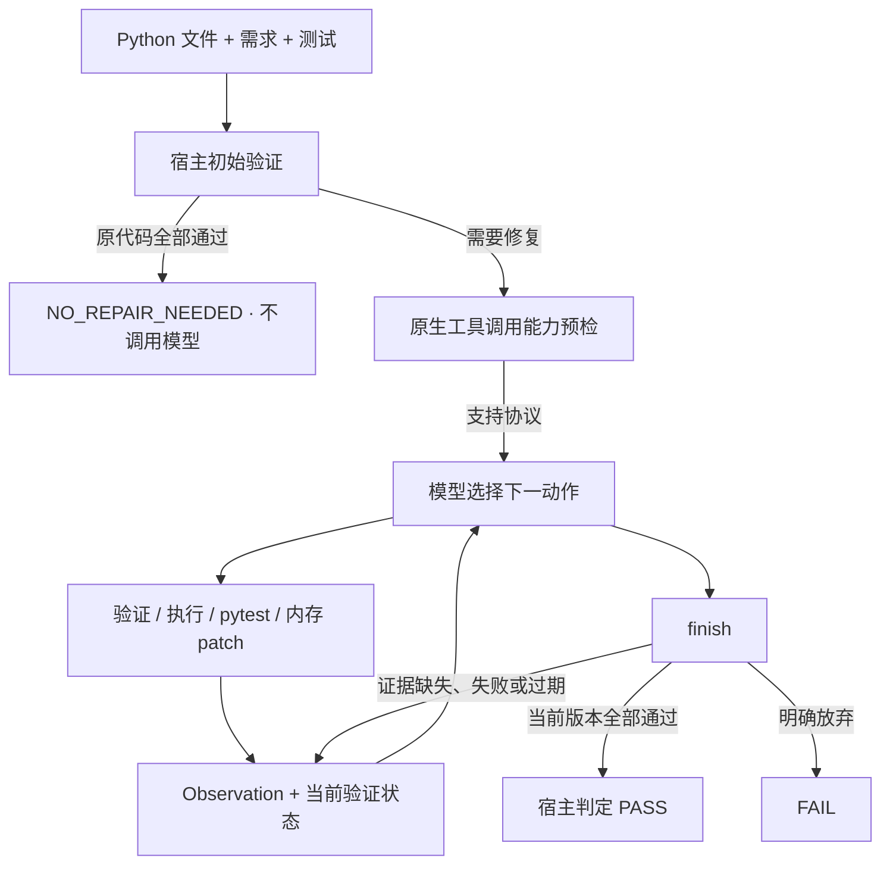

# Dependency-Aware Codegen

[English](README.md)

一个从依赖感知验证、小模型实验逐步演进到 observation 驱动 Agent loop 的 Python 代码修复项目。模型负责选择工具和修改候选代码，宿主负责权限、版本、正式验证和最终判定。

当前系统面向 **Python 单文件修复**，真实模型验证使用本地 Ollama。原有 one-shot 单次修复流程继续保留，作为回归和评估基线。

## 项目要解决的问题

LLM 生成的 Python 代码可能引用不存在的包或 API、使用错误参数、运行时报错，或者语法和 API 都合法但结果不符合需求。如果只让另一个模型判断代码是否正确，只是把不确定性转移给了另一个模型。

本项目将确定性的 AST、包/API 验证、执行和 pytest 证据与模型修复结合起来。模型可以提出动作，但只有宿主掌握的真实证据才能得到 `PASS`。

## 项目演进脉络

项目没有直接从大模型 Agent 开始，而是沿着一条连续的工程路线逐步升级：

| 阶段 | 目标与结果 |
| --- | --- |
| **0.5B 可行性验证** | 构建数据集、确定性验证流水线和受控修复评估，使用可在 CPU 上运行的小型代码模型验证“依赖/API 证据辅助修复”是否可行，同时暴露弱基础模型的能力上限。 |
| **0.5B LoRA 微调** | 使用 PEFT/LoRA 和防泄漏的数据划分适配小模型。选中的 LoRA 条件将执行/测试通过数从通用 0.5B 的 **77/210** 提升到 **127/210**。 |
| **7B 工程化流程** | 将实验模型升级为 Ollama 上的 Qwen2.5-Coder 7B，完成外部文件 CLI、确定性触发、结构化失败证据、单次修复和宿主重验。受控集合达到 **197/210**，工程 sanity 集达到 **8/8 修复 + 2/2 control**。 |
| **30B Agent loop** | 使用 Qwen3-Coder 30B 原生工具调用，将单次修复升级为可反复观察、修改和验证的 Agent。历史 M7.2 达到 **15/15**，其中严格多轮救回 **1/1**，正确 control 保持 **5/5**；这些开发期间使用过的案例继续作为回归集。 |

这些历史实验用于说明项目如何演进到当前架构，并不声称模型规模、微调、后端和 Agent 架构构成了严格的单变量消融；不同阶段的模型、运行后端和评估集合并不完全相同。

## 当前 Agent loop


```mermaid
flowchart TD
    A[Python 文件 + 需求 + 测试] --> B[宿主初始验证]
    B -- 原代码全部通过 --> C[NO_REPAIR_NEEDED · 不调用模型]
    B -- 需要修复 --> D[原生工具调用能力预检]
    D -- 支持协议 --> E[模型选择下一动作]
    E --> F[验证 / 执行 / pytest / 内存 patch]
    F --> G[Observation + 当前验证状态]
    G --> E
    E --> H[finish]
    H -- 证据缺失、失败或过期 --> G
    H -- 当前版本全部通过 --> I[宿主判定 PASS]
    H -- 明确放弃 --> J[FAIL]
```

核心控制逻辑包括：

- **模型自主选择策略**：模型选择包/API 验证、执行、pytest、`apply_patch`、rollback 或 finish，宿主不预设固定修复顺序。
- **以真实证据结束**：每次 patch 都生成新的候选版本并使旧检查失效。提前声明成功会返回 `FINISH_PRECONDITION_FAILED`，模型可以继续行动。
- **默认只修改内存候选**：unified diff 原子应用；只有显式 `--apply`、宿主验证 PASS、快照和写后重验全部满足时才写回源文件。
- **上下文与运行有界**：宿主限制步数、全局时间、协议错误和无进展重复动作；完整工具结果保存到 artifact，模型上下文只保留精简 observation。
- **工具边界检查**：敏感操作前检查权限、路径范围、源/测试哈希和保守的 AST 风险规则。

## 快速开始

需要 Python 3.10+、Ollama，以及支持原生工具调用的模型：

```powershell
python -m pip install -e ".[dev]"
ollama pull qwen3-coder:30b
```

将以下配置保存为 `agent.local.json`：

```json
{
  "agent": {
    "provider": "ollama",
    "max_steps": 24,
    "timeout_seconds": 300,
    "ollama": {
      "model_name": "qwen3-coder:30b",
      "base_url": "http://localhost:11434",
      "context_length": 16384,
      "max_new_tokens": 2048,
      "temperature": 0,
      "keep_alive": "10m"
    }
  }
}
```

运行仓库中的示例：

```powershell
python -m depguard.cli agent --config agent.local.json --project-root . --code-file examples/m5/input.py --test-file examples/m5/test_input.py --requirement "Return three as result." --output results/agent_demo.json
```

替换路径和需求即可处理自己的代码。正式测试由用户提供且保持只读；`--project-root` 用来限定允许访问的项目范围。

默认是 dry-run：候选代码和轨迹写入 JSON，不修改源文件。只有明确添加 `--apply` 时，才会将宿主验证通过的候选写回。主要输出字段包括：

- `final_status` 与 `termination_reason`；
- `agent_invoked`、`capability_probe` 与 `finish_verification`；
- `candidate_code`、基于修订号和哈希的 `candidate_version`、规范化 diff；
- 当前验证证据和完整工具轨迹；
- 使用 `--apply` 时的快照、持久化和 rollback 结果。

正确输入直接返回 `NO_REPAIR_NEEDED`，不会调用修复模型。触发修复的任务区分 `PASS`、`FAIL`、`INCOMPLETE` 和 `ERROR`。轨迹只保存简短、公开的动作摘要，不保存模型隐藏推理。

原 one-shot 单次修复入口仍然可用：

```powershell
python -m depguard.cli run --config configs/engineering_7b_ollama.yaml --requirement "Compute the arithmetic mean of 2, 5, and 8 as result." --code-file data/engineering_sanity/cases/function_statistics_average/input.py --test-file data/engineering_sanity/cases/function_statistics_average/test_input.py --output results/one_shot_demo.json
```

无需真实模型的 Agent 编排演示可以使用 `configs/m5_scripted.json`。它使用脚本决策但执行真实工具，只用于验证基础设施，不计入模型能力指标。

## 评估：200 个单文件缺陷任务

使用同一本地 Qwen3-Coder 30B，在 **200 个冻结的单文件缺陷任务**上比较单次修复与 Agent；正确代码样本不计入此数量。记录来源、输入、测试和配置，保留失败及中断结果。

| 来源 | 缺陷任务 | 单次修复通过 | Agent 通过 | Agent 中断未知 |
| --- | ---: | ---: | ---: | ---: |
| QuixBugs 公开算法缺陷 | 29 | 25 | 22 | 1 |
| 公开库缺陷适配 | 4 | 3 | 2 | 1 |
| HumanEvalPack 公开人工缺陷 | 100 | 95 | 63 | 1 |
| 人工综合场景 | 36 | 27 | 27 | 0 |
| 人工 API 场景 | 31 | 29 | 20 | 0 |

HumanEvalPack 的错误由人工植入，不是真实生产故障；项目编写的场景也明确标注为人工来源。公开基准可能进入预训练，正式测试对模型可见，尚未测量独立隐藏测试或人工接受率，因此不把这些来源合并成生产修复率。
不预设 Agent 优于单次修复；报告保留配对结果、严格多轮救回、补丁拒绝原因和实际成本。前两批另有 20 个相关正确代码样本全部保持不变，未计入 200 个缺陷任务。

[完整任务索引](results/expansion200_v1/coverage_200.json) · [131例扩展报告](results/expansion200_v1/report.md) · [机器可读统计](results/expansion200_v1/summary.json) · [早期公开基准](results/external_eval_v1/report.md) · [早期混合来源报告](results/horizontal_eval_v1/report.md) · [评估方法](docs/EVALUATION_200_PLAN.md)

## 历史 Agent 评估（M7.2）

M7.2 对照在 one-shot 和 Agent 条件下使用相同的 Qwen3-Coder 30B digest、生成参数、需求、源文件和正式测试。该次 Agent 复测逐字节复用了原 15 份 one-shot artifact，没有重新采样或择优。这些案例曾用于开发分析，不能作为独立泛化评估。

| 指标 | 结果 |
| --- | ---: |
| One-shot 最终通过 | 14/15 |
| Agent 最终通过，含无需修复的 control | 15/15 |
| 严格多轮救回 | 1/1 |
| Control 保持且不调用模型 | 5/5 |
| 触发修复任务的原生协议成功 | 10/10 |
| 虚假成功 | 0/15 |
| 越权拒绝 / rollback | 5/5 · 1/1 |

`weights` 的首次 patch 后 pytest 仍失败，模型读取新反馈后应用了不同 patch 并通过；`runs` 的提前 finish 被拒绝后，模型自行选择缺失检查并最终成功。

严格救回的有效分母只有 1，而且案例规模小、由人工准备、正式测试对模型可见。这些结果证明真实、可审计的 loop 已经跑通，不能外推为对通用编程 Agent 的全面优势。相比上一版 Agent，平均耗时也从 19.392 秒增加到 27.119 秒。

[最终报告](results/m72/report.md) · [机器可读摘要](results/m72/summary.json) · [复现与指标定义](docs/M7_2.md)

## 架构与目录

- `src/depguard/analysis/`、`verification/`：AST、依赖和 API 分析。
- `src/depguard/execution/`：子进程执行与 pytest 证据。
- `src/depguard/agent/`：触发门、状态机、工具注册、patch、验证状态与持久化。
- `src/depguard/models/`：Ollama/云端原生工具适配器和 scripted 测试模型。
- `training/`：历史数据集、Transformers 与 LoRA 工具。
- `evaluation/`、`data/`、`results/`：冻结案例、评估脚本、manifest 与可复核 artifact。

0.5B/LoRA 和 7B 的历史实验可查看[项目概述](docs/PROJECT_SUMMARY.md)，当前 Agent 契约与控制逻辑见[架构文档](docs/AGENT_ARCHITECTURE.md)。

## 验证与局限

```powershell
python -m pytest
python -m ruff check .
```

最近一次全量验证为 **252 passed，1 skipped**；另有 **3 项中断统计测试通过**。跳过项来自 Windows 未授予符号链接创建权限，ruff 通过。

当前项目面向 Python 单文件修复，不是能够自主处理完整仓库的通用编程 Agent。最终正确性取决于正式测试质量和验证器覆盖率；静态风险分析与 regression guard 仍是保守的启发式规则。子进程、临时目录和 timeout 只提供进程与时间边界，**不是用于执行不可信代码的强化安全沙箱**。如果公开部署，还需要更强的执行隔离、身份认证、资源限制和任务调度。
